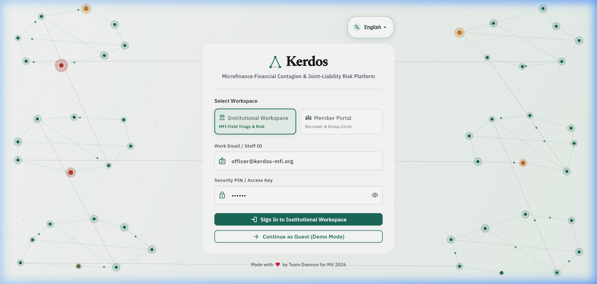
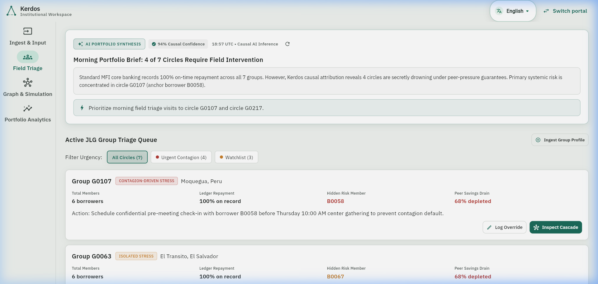
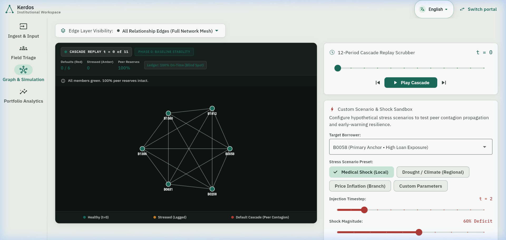
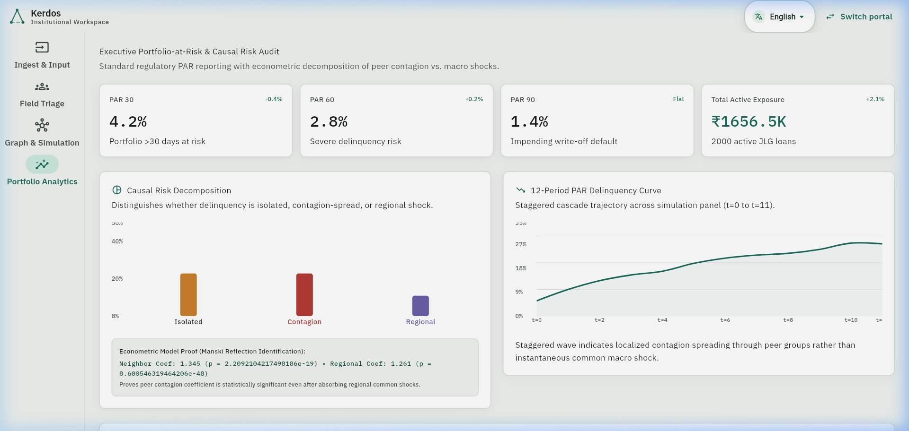

<div align="center">

# Kerdos
**Contagion Prevention & Relational Financial Intelligence Platform for Joint Liability Lending**

[](https://flutter.dev)
[](https://fastapi.tiangolo.com)
[](https://pyg.org)
[](https://www.python.org)
[](https://github.com)
[](https://opensource.org/licenses/MIT)

</div>

***

## Overview

Kerdos is a financial intelligence and systemic risk mitigation platform engineered for microfinance institutions operating Joint Liability Group lending circles.

In standard solidarity lending, groups of five to ten borrowers collectively guarantee individual loans. Traditional core banking ledgers monitor portfolios using backward looking repayment rates. When an individual borrower faces acute distress, peers quietly deplete their emergency savings to cover the installment. The core banking system records one hundred percent on time repayment, while collective resilience is severely hollowed out. A minor secondary disruption subsequently causes an abrupt, multi borrower default cascade.

Kerdos detects masked distress before group collapse occurs by synthesizing multi relational network topologies, dual model machine learning ensembles, and econometric causal identification.

***

## Visual Interface and Interactive Workflows

### 1. Executive Entry and Organic Network Mesh
The entry gateway renders an interactive twenty eight node relational mesh modeling dynamic stress propagation and ledger recovery across connected solidarity clusters.

<p align="center">
  
</p>

### 2. Institutional Field Triage and AI Overview
The flagship triage view contrasts on paper records against hidden reality, highlighting where peer emergency savings have been depleted behind a deceptive one hundred percent repayment ledger, accompanied by live AI synthesis and human override logging.

<p align="center">
  
</p>

### 3. Graph Simulation Lab and Cascade Sandbox
An interactive dark viewport displaying multi relational edge topologies with layer filtering, twelve period historical cascade replay, and forward Monte Carlo shock injection testing group survival probabilities.

<p align="center">
  
</p>

### 4. Portfolio Analytics and Econometric Causal Attribution
Executive Portfolio at Risk metrics in Indian Rupees, three way causal risk decomposition, and instrumental variable econometric validation confirming peer contagion operates independently of regional macro shocks.

<p align="center">
  
</p>

***

## The Three Causal Categories of Financial Distress

When stress emerges, traditional classifiers generate a single default probability. Kerdos distinguishes three mutually exclusive causal mechanisms:

1. Isolated Stress
Idiosyncratic personal emergency where neighboring group members remain resilient. Action: Provide confidential individual assistance.

2. Contagion Driven Stress
Endogenous peer contagion where default risk transmits through solidarity guarantees and depleted savings. Action: Pre meeting group restructuring before collective collapse.

3. Regional Shock
Exogenous common shock such as drought or local market disruption affecting all members. Action: District level moratorium without penalizing group standing.

***

## Econometric and Machine Learning Pipeline

1. Multi Relational Network Topology
Encodes one hundred ten thousand eight hundred seventy edges across three distinct layers:
* Joint liability solidarity guarantee layer with weight 1.0
* Shared field officer and center meeting layer with weight 0.7
* Shared geographic district layer with weight 0.2

2. XGBoost Baseline Vulnerability Classifier
Evaluates individual loan sizing, installment burdens, past delinquency velocity, and center meeting attendance to predict individual baseline risk independent of peer behavior.

3. GraphSAGE Graph Neural Network
Built with PyTorch Geometric using a two hop neighborhood aggregator to produce thirty two dimensional inductive node embeddings capturing topological stress transmission.

4. Manski Reflection Econometric Explainer
Solves the classical reflection problem through instrumental variable panel regressions, statistically proving that peer contagion operates independently of macro regional shocks.

5. Stochastic Monte Carlo Cascade Engine
Executes two hundred fifty forward simulation iterations across discrete timesteps to quantify empirical group survival probabilities and evaluate intervention policies against strict false positive guardrails.

***

## Architecture and Repository Structure

```
to_push/
│
├── README.md
├── LICENSE
├── .gitignore
├── ai_model_context.md
├── system_architecture_and_user_guide.md
│
├── docs/
│   └── images/
│       ├── landing_mesh.png
│       ├── field_triage.png
│       ├── graph_simulation.png
│       └── portfolio_analytics.png
│
├── backend/
│   ├── main.py
│   ├── data_loader.py
│   ├── requirements.txt
│   ├── audit_logs.jsonl
│   └── routers/
│       ├── borrower.py
│       ├── portfolio.py
│       ├── simulation.py
│       └── triage.py
│
├── frontend/
│   ├── pubspec.yaml
│   ├── pubspec.lock
│   ├── analysis_options.yaml
│   ├── lib/
│   ├── web/
│   ├── android/
│   ├── assets/
│   ├── model_outputs/
│   └── test/
│
├── model_train/
│   ├── daemon_boa.ipynb
│   ├── daemon_dino.ipynb
│   └── outputs/
│
└── presentations/
    ├── Kerdos Pitch Deck_compressed.pdf
    └── sample_ppt.pptx
```

***

## Quick Start Guide

### Step 1: Start the Python FastAPI Service

```bash
cd backend
python -m pip install -r requirements.txt
python -m uvicorn main:app --host 0.0.0.0 --port 8000
```

Verify service status by visiting:
http://localhost:8000/api/health

### Step 2: Run the Flutter Application

```bash
cd frontend
flutter pub get
flutter run -d chrome --web-port 3000
```

To build the standalone mobile application:

```bash
flutter build apk --release
```

***

## Ethical and Privacy Guarantees

1. Zero Social Exposure
Borrower distress flags and savings depletion indices are exclusively visible to authorized institutional field officers. The member portal strictly redacts peer distress to eliminate social stigma and peer harassment.

2. Demographic Fairness
Protected characteristics including caste, religion, gender, and proxy variables are strictly excluded from the feature store. Continuous audits guarantee demographic parity ratios exceeding 0.80 across all branches.

3. Human in the Loop
Every algorithmic recommendation is advisory. Interventions require verified loan officer authorization recorded in an immutable audit log.
